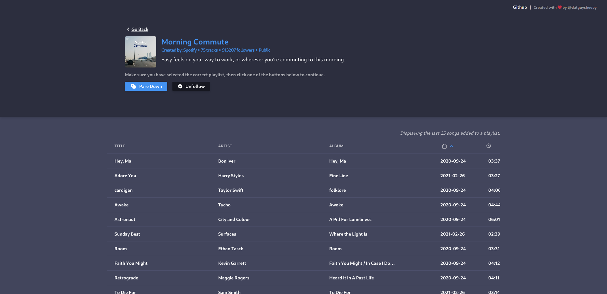

# Pare Down for Spotify

Do you have one or more big playlists (+1000 songs) and your mobile data is limited? If so, you can use Pare Down for Spotify to create copy of selected playlist with amount of songs you've choosen to. Now you can download smaller version of your playlist and still enjoy your music without worrying about data limit.

### **This is how the Pare Down has changed over time**:

<table align="center">
	<tr>
		<td></td>
		<td></td>
    <td></td>
	</tr>
	<tr align="center">
		<td>first version</td>
		<td>first redesign</td>
    <td>latest redesign</td>
	</tr>
</table>

## 📖 How to use Pare Down:

- First you need to login with your Spotify account and grant Pare Down app permission to access some of your data (more about it [here](#For-users)).
- After granting permission you will be redirect to page with list of all of your playlists (you can see their name, cover and total number of songs in a playlist).
- Now, you need to select one of the displayed playlists by clicking on it - where you can see more details about that playlis (description, last 25 songs added to it) and where're the buttons to do something with that playlist (Pare Down, edit or remove it from your library).
  - Clicking Pare Down will show a modal where you will be available to customize details of your pared down playlist (name, description, number of songs) and also where you will need to confirm the pare down process (after all the details are properly filled).
  - Clicking Edit will show a modal where you can edit couple of details about that playlist (name, description and is it public).
  - By clicking the Remove button, pop up will be displayed to confirm the deletion of the playlist from your library.

## 🐞 Hey I found a bug!

Something doesn't work like it should? Or maybe page looks like it shouldn't? If so, [go here to create issue](https://github.com/datguysheepy/pare-down/issues/new) - please choose appropriate title and in description include everything that you think will be useful for fixing this bug!

## 🙋 FAQ:

#### **_For users_**:

**Q:** What permissions do I grant Pare Down to access to?\
**A:** Pare Down now have access to:

- view and edit your public playlists.
- view and edit your private playlists.
- view your collaborative playlsits
- upload images to personalize your profile or playlist cover.

**Q:** Is Pare Down free to use?\
**A:** Yes, you can pare down as many playlists as you want. Every feature that Pare Down offers is completely free for everybody.

**Q:** Do you plan to create paid version of Pare Down?\
**A:** No, I don't think there's a need to create paid version of Pare Down. This is a simple project that was initially, this project was created to develop my skills and to give me something to enter into my resume.

**Q:** Can I change pared down album cover?\
**A:** Yes, but only using Spotify app. Pare Down don't offer option to do it from inside of it.

**Q:** Something didn't work as it should, can I somehow report it?\
**A:** [Yes, here](https://github.com/datguysheepy/pare-down/issues/new). Please choose appropriate title and in description describe this problem as accurately as you can.

**Q:** I have this great idea for Pare Down, where I can share it with you?\
**A:** [Here](https://github.com/datguysheepy/pare-down/issues/new). Please choose appropriate title and description.

#### **_For developers_**

**Q:** With what Pare Down was built with?\
**A:** React+Typescript with help of the wonderful NextJS (used for both frontend and REST API - which handles requests to the Spotify Web AP). Styled with TailwindCSS and styled-components (supported by twin.macro).

**Q:** Where is Pare Down hosted?\
**A:** Both the Frontend and REST API backend is hosted on [Vercel](https://vercel.com/)

**Q:** How can I contribute to this project?\
**A:** You can create PR with fixed bugs or new functionalities that you thought will be great addition to the Pare Down. Below you can read more about contribution and how to test it on your machine.

## 🤝 Contribution:

### To test Pare Down locally you need to do couple of things:

- run `yarn install` and then `yarn dev` in the root directory of this cloned project.
- now you can go to [http://localhost:3000](http://localhost:3000) to view it in the browser.
- here you have 2 options in order to make the REST API of Pare Down to work:
  - create new app on the [Spotify Developer Dashboard](https://developer.spotify.com/dashboard/) website, set the `redirect_url` to `localhost:3000` and then copy `client_id` **and** `client_secret` from there to `.env.local` file (which you need to create on the root folder of Pare Down).
- After all of that you should be available to develop and test Pare Down locally.

**Remember!**\
In order to test the build version of the app locally you need to use 2 commands. First the `yarn build` command and then the `yarn start` command.

## 📝 License

Pare Down for Spotify is an open-source project licensed under the [MIT License](https://github.com/datguysheepy/pare-down/blob/master/LICENSE).
